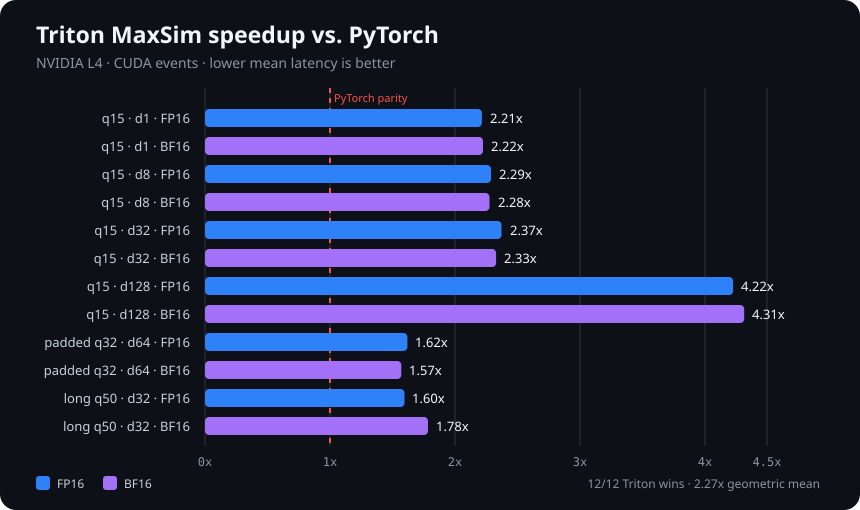

# ColPali Reproduction with Triton MaxSim

[](https://github.com/derekk024/colpali-triton/actions/workflows/ci.yml)
[](https://www.python.org/)
[](LICENSE)
[](reports/phase_12_final_report.md)

This repository is a scoped reproduction of
[ColPali: Efficient Document Retrieval with Vision Language Models](https://arxiv.org/abs/2407.01449).
Phases 1–12 are complete: paper analysis, tested
PyTorch MaxSim references, the paper's hardest-in-batch loss, a controlled
synthetic overfit proof, pinned ViDoRe loaders, measured OCR-text baselines,
paper-era PaliGemma/ColPali and LoRA integration, a real Apple MPS smoke test,
scoped multimodal results with a mean-pooled ablation, and a reproducible CUDA
container, guarded AWS L4 workflow, tuned Triton kernel, NVIDIA L4 benchmark,
Nsight profile, and final report.

Phase 6 uses a revision-pinned BGE-M3 checkpoint and remote, column-selective
reads of two ViDoRe tasks. Phase 7 pins the public BF16 ViDoRe base and the
original released adapter by full revision and weight digest. Phase 11 is
verified on an NVIDIA L4: the Triton forward kernel passed every required CUDA
case, won all 12 canonical FP16/BF16 benchmark comparisons, achieved a 2.27x
geometric-mean speedup over vectorized PyTorch, and produced a valid Nsight
Compute report. GPU evidence is bound to the exact lifecycle launch receipt
and independently rechecked against EC2 instance metadata.

## Key results

| Result | Measurement |
| --- | ---: |
| Triton versus PyTorch | **2.27x** geometric-mean speedup |
| Canonical GPU wins | **12 / 12** FP16/BF16 cases |
| Mean-latency speedup range | **1.57x–4.31x** |
| Largest avoided PyTorch intermediate | **41.8 MB → 1.5 KB** incremental allocator peak |
| Required CUDA parity cases | **5 / 5**, zero skips |
| Test suites | **664 local + 276 GPU passed** |
| DocVQA subset nDCG@5 | **0.672** MaxSim vs. **0.280** mean pooling |
| InfoVQA subset nDCG@5 | **0.868** MaxSim vs. **0.690** mean pooling |



The [final report](reports/phase_12_final_report.md) separates reproduced
findings, controlled ablations, new kernel results, and limitations. The
compact [GPU record](reports/phase_11_gpu_results.json) preserves the measured
values and SHA-256 hashes of the ignored sealed artifact bundle.

## Completion status

The scoped project is complete. Generated model, dataset, and raw benchmark
artifacts remain ignored; compact results and integrity hashes are committed.

| Acceptance item | Status |
| --- | --- |
| Local unit suite | Complete: 664 passed |
| Nested-loop/vectorized PyTorch parity and gradients | Complete |
| Controlled synthetic overfit | Complete |
| Two real retrieval baselines | Complete |
| Scoped released-ColPali results and mean-pooling ablation | Complete |
| Pinned CUDA/AWS environment and benchmark protocol | Complete |
| Triton execution and PyTorch numerical parity on NVIDIA | Complete: 5 required CUDA cases, zero skips |
| Reproducible GPU latency, throughput, memory, profiling, and tuning | Complete: 12/12 Triton wins, 2.27x geometric mean |
| Final discrepancies/limitations report | Complete |

## Current implementation

ColPali represents a query and a document page as sets of token or patch
embeddings. Their late-interaction score is:

```text
score(q, d) = sum over query tokens i of max over document tokens j
              dot(q[i], d[j])
```

`colpali_triton.maxsim` computes every query-document pairing. It accepts either
unbatched `[tokens, dimension]` embeddings or batched
`[batch, tokens, dimension]` embeddings. Optional Boolean masks exclude padded
query or document positions.

```python
import torch

from colpali_triton import maxsim

queries = torch.tensor([[[1.0, 0.0], [0.0, 1.0]]])
documents = torch.tensor(
    [
        [[1.0, 0.0], [0.0, 2.0]],
        [[-1.0, 0.0], [0.0, -2.0]],
    ]
)

scores = maxsim(queries, documents)
assert scores.shape == (1, 2)
```

The scorer deliberately does not L2-normalize its inputs. The model encoder
normalizes projected embeddings once, before indexing or scoring.
The final query-token reduction accumulates in float32 for float16, bfloat16,
and float32 inputs, and in float64 for float64 inputs.

Mask semantics are explicit:

- `True` means a real token or patch; `False` means padding.
- Masked query positions contribute zero.
- Masked document positions cannot win the maximum, including when all valid
  similarities are negative.
- A query with no valid tokens scores `0`.
- A document with no valid tokens scores `-inf` against a nonempty query.

## Training objective

For a square in-batch score matrix, the positive for query `k` is
`scores[k, k]` and its negative is the largest off-diagonal value in row `k`.
The paper's one-way pairwise objective is:

```text
loss = mean_k softplus(hardest_negative[k] - positive[k])
```

It is available as:

```python
from colpali_triton import hardest_in_batch_contrastive_loss

loss = hardest_in_batch_contrastive_loss(scores)
```

This is intentionally not full in-batch InfoNCE, and it is not symmetrized in
the document-to-query direction.

## Synthetic overfit proof

The phase-5 experiment trains independent, randomly initialized query and
document multi-vector tables through L2 normalization, MaxSim, and the real
hardest-negative loss. It uses variable-length masks and no external data.

```bash
.venv/bin/python scripts/overfit_synthetic.py
```

With the committed seed-17 configuration, the recorded run achieved:

- loss `0.9450667500 → 0.0888411775` (90.60% reduction);
- paired top-1 accuracy `2/6 → 6/6`;
- minimum positive-versus-hardest-negative margin `2.037635`;
- nonzero valid query and document gradients;
- exactly zero padding gradients and padding-parameter changes.

The full configuration, measured output, limitations, and environment are in
[the phase-5 report](reports/phase_5_synthetic_overfit.md).

## Phase 6 text baselines

The evaluation subset contains the official 500-page test subsamples of
DocVQA and InfoVQA. The loader combines revision-pinned BEIR queries/qrels with
revision-pinned page-level Tesseract OCR, validates exact row/count contracts,
and checks a committed semantic fingerprint before evaluation.

Two complete-corpus baselines are implemented:

- BM25Okapi formula parity with `rank-bm25==0.2.2`, scored over deterministic
  overlapping word windows and aggregated by maximum chunk score per page.
- Revision-pinned `BAAI/bge-m3` dense embeddings with normalized dot product
  over the same windows and maximum chunk score per page.

The four measured runs produced:

| Task | Baseline | nDCG@5 | Recall@5 | MRR@5 |
| --- | --- | ---: | ---: | ---: |
| DocVQA | BM25 | 0.3246 | 0.3653 | 0.3127 |
| DocVQA | BGE-M3 | 0.3112 | 0.3693 | 0.2929 |
| InfoVQA | BM25 | 0.5743 | 0.6518 | 0.5489 |
| InfoVQA | BGE-M3 | 0.6802 | 0.7504 | 0.6576 |

These are local OCR-text measurements, not ColPali or paper-result
reproductions. Fixed Tesseract word windows also differ from the paper's
Unstructured plus Claude-captioned text pipeline. Full quality, latency,
throughput, memory, index-size, provenance, and truncation details are in
[the Phase 6 baseline report](reports/phase_6_text_baselines.md).

## Phase 7 multimodal integration

The retrieval model uses the final PaliGemma hidden state, a shared biased
`2048 → 128` projection, per-position L2 normalization, and exact-zero masked
positions. Documents use the prompt `Describe the image.` and retain 1,024
image positions plus six prompt positions. Queries use the `Question: ` prefix,
five adjacent `<unused0>` augmentation tokens, and no image positions after
preprocessing.

The paper LoRA topology is reproduced with rank 32, alpha 32, dropout 0.1,
Gaussian initialization, and adapters on all language-model attention/MLP
linear layers plus the retrieval projection. The vision tower and multimodal
projector remain frozen. The released adapter was independently verified to
contain 127 LoRA A/B pairs and 39,292,928 adapter parameters.

```python
import torch
from PIL import Image

from colpali_triton import late_interaction_scores, load_phase7_config
from colpali_triton.checkpoints import load_released_colpali

config = load_phase7_config("configs/colpali_phase7.json")
released = load_released_colpali(
    config,
    cache_dir="artifacts/huggingface_phase7",
    device="mps",
)

page = Image.open("page.png")
document_batch = released.processor.process_documents([page]).to(
    released.device,
    pixel_dtype=released.dtype,
)
query_batch = released.processor.process_queries(
    ["Which total is shown?"]
).to(released.device)

with torch.inference_mode():
    documents = released.model(**document_batch.as_model_inputs())
    queries = released.model(**query_batch.as_model_inputs())
    scores = late_interaction_scores(queries, documents)
```

Loading verifies approximately 5.93 GB of pinned public base and adapter
weights before inference. The gated Google checkpoint in the manifest is a
source reference, not a claim that its current revision is the paper's original
training revision. See [the Phase 7 integration report](reports/phase_7_model_integration.md)
for the exact revisions, contracts, and checks.

## Phase 8 MPS smoke result

The released BF16 base and paper adapter completed a real document/query
forward pass on the Apple M3 Pro GPU. The deterministic 448-pixel test page
produced `[1, 1030, 128]` document vectors; the augmented query produced
`[1, 15, 128]` query vectors. All active-vector norms were within `0.00385` of
one, masked values were exactly zero, and PyTorch MaxSim returned the finite
score `13.28125`.

Observed synchronized MPS allocator snapshots reached 6,007,417,856 current
bytes and 8,765,964,288 driver bytes against PyTorch's 12,884,918,272-byte
recommended maximum. Single-shot document encoding took 3.066 seconds and
query encoding took 0.962 seconds. These cold smoke timings are not benchmark
claims.

See [the Phase 8 report](reports/phase_8_mps_smoke.md) for the verified
artifact digests, exact environment, initial defect found by the smoke run,
raw-record digest, limitations, and reproduction command.

## Phase 9 scoped ColPali results

Before scoring, Phase 9 fixed 50 queries and 100 pages from each of DocVQA and
InfoVQA by a committed SHA-256 identifier-order rule. Every positive page for
every selected query is included, and each query is evaluated against all 100
pages. The source Parquet files, selected identifiers, query text, qrels, and
encoded image bytes are revision-pinned and fingerprinted.

| Task | Scorer | nDCG@5 | Recall@5 | MRR@5 |
| --- | --- | ---: | ---: | ---: |
| DocVQA | ColPali MaxSim | 0.6720 | 0.8200 | 0.6217 |
| DocVQA | Normalized mean pooling | 0.2805 | 0.3200 | 0.2667 |
| InfoVQA | ColPali MaxSim | 0.8679 | 0.9000 | 0.8567 |
| InfoVQA | Normalized mean pooling | 0.6904 | 0.8400 | 0.6413 |

Both scorers consume the same released-model token vectors and query
encodings; only aggregation changes. The BF16 multi-vector payload plus its
Boolean mask uses 264,710 bytes per page, while the float32 mean vector uses
512 bytes. Local indexing measured about 0.52 pages/second on both tasks.

These are real scoped-subset measurements, not the paper's full-task results.
The earlier Phase 6 BM25 and BGE-M3 runs use the full 500-page subsamples, so
their quality numbers are not treated as direct head-to-head subset
comparisons. Exact selection rules, timing, throughput, memory, score-matrix
digests, raw-result digests, and limitations are in
[the Phase 9 report](reports/phase_9_colpali_subset.md).

## Phase 10 environment and Phase 11 NVIDIA results

The GPU environment is pinned to `linux/amd64` and the immutable base:

```text
pytorch/pytorch:2.6.0-cuda12.4-cudnn9-devel@sha256:0cf3402e946b7c384ba943ee05c90b4c5a4a05227923921f2b0918c011cfaf56
```

It asserts PyTorch 2.6.0, CUDA 12.4, and Triton 3.2.0. The AWS lifecycle tool
accepts only `g6.xlarge` or `g6.2xlarge`, requires an explicit region, subnet,
security group, and key name, and makes `plan` entirely offline:

```bash
python3 infra/aws/l4_lifecycle.py plan \
  --region us-west-2 \
  --subnet-id subnet-0123456789abcdef0 \
  --security-group-id sg-0123456789abcdef0 \
  --key-name colpali-benchmark
```

`launch` remains offline unless both `--execute` and the exact cost
acknowledgement are supplied. Execution resolves and records an immutable
Amazon-owned GPU DLAMI, performs AWS permission dry-runs, launches one tagged
instance, and writes a protected receipt. Phase 11 accepts only a receipt that
matches the current source commit, environment contract, AWS account, region,
AMI, instance, subnet, and security group. Termination requires the exact
instance ID twice and verifies all managed tags before mutation. See
[the AWS L4 guide](infra/aws/README.md) for launch, deployment, status, and
termination commands.

The tuning pass fixed 12 explicit launch candidates across four representative
shapes and FP16/BF16. It performs 12,000 bounded CUDA-event measurements after
96 cold correctness gates and 960 warmups. The selected winner is validated
with the production schema, then substituted into the full six-shape,
two-dtype PyTorch-versus-Triton benchmark. The profiler must use that same
winner.

On the L4, `tq16_td128_w4_s2` was selected: 16 query tokens, 128 document
tokens, embedding block 128, four warps, and two stages. Triton won every
canonical case:

| Dtype | Mean-latency speedup range | Largest absolute error |
| --- | ---: | ---: |
| FP16 | 1.60x–4.22x | 0.001039 |
| BF16 | 1.57x–4.31x | 0.009487 |

Across all 12 cases the geometric-mean speedup was 2.27x. PyTorch's largest
incremental allocation was 41,798,144 bytes; Triton's largest was 1,536 bytes.
The CUDA host suite passed 276 tests with one expected MPS skip, all five
mandatory parity cases executed, and Nsight Compute captured a valid report
for the selected winner.

```bash
python benchmarks/benchmark_maxsim.py --preflight
python benchmarks/tune_triton_maxsim.py --preflight
python benchmarks/benchmark_maxsim.py
```

The local preflight correctly reports that this Mac lacks a CUDA PyTorch build
and Triton runtime. The completed fail-closed remote workflow deployed clean
committed source, proved all five CUDA parity cases ran without skips, tuned,
benchmarked the winner, captured a real Nsight report, and independently
verified the sealed bundle. To reproduce it, first print the offline plan:

```bash
python3 infra/aws/phase11_remote.py \
  --host 203.0.113.10 \
  --identity-file /absolute/path/to/key.pem \
  --launch-receipt artifacts/phase10/aws_launch_receipt.json
```

Execution is detached and resumable, with a four-hour job cap. An independent
recovery finalizer cleans only containers labeled for the exact run, proves
none remain, and seals an interrupted run as `incomplete` before retrieval.
See the AWS guide for the separate execution acknowledgement and termination
command.

See the [final report](reports/phase_12_final_report.md), the compact
[GPU result record](reports/phase_11_gpu_results.json), the historical
[Phase 11 preflight report](reports/phase_11_preflight.md), the
[AWS L4 guide](infra/aws/README.md), and the
[benchmark protocol](benchmarks/README.md).

## Local setup

Python 3.9 or newer is supported.

```bash
python3 -m venv .venv
source .venv/bin/activate
python -m pip install --upgrade pip
python -m pip install -c configs/phase6_macos_arm64_constraints.txt \
  -e ".[test,evaluation]"
python -m pytest
```

The constraints file records the exact Apple-arm64 Phase 6 dependency graph.
Use a clean virtual environment for benchmark measurements. A
`--system-site-packages` environment may be convenient for development, but
its unrelated packages can make `pip check` fail and are recorded as an
environment limitation in the local report.

For the Phase 7 multimodal code and released checkpoint, create a clean
environment with the newer pinned constraints:

```bash
python3 -m venv .venv-phase7
source .venv-phase7/bin/activate
python -m pip install --upgrade pip
python -m pip install -c configs/phase7_macos_arm64_constraints.txt \
  -e ".[test,evaluation,multimodal]"
python -m pip check
python -m pytest
```

Run one measured baseline from the project root:

```bash
.venv/bin/python scripts/evaluate_text_baseline.py \
  --task docvqa \
  --baseline bm25 \
  --output artifacts/phase6/docvqa_bm25.json
```

For BGE-M3 on Apple Silicon, use `--baseline dense --device mps`. The first
dense run downloads the pinned 2.27 GB checkpoint into the ignored
`artifacts/huggingface` cache and verifies its size and SHA-256 before model
loading. The runner never replaces an existing output unless `--overwrite` is
explicitly supplied.

## Repository layout

```text
src/colpali_triton/       scorers, models, processing, loaders, and metrics
tests/                    unit, gradient, integration-contract, and overfit tests
reports/                  paper notes, implementation plan, and recorded results
configs/                  committed experiment settings and thresholds
scripts/                  reproducible experiment entry points
benchmarks/               reproducible CUDA/Triton correctness and timing harness
docker/                   digest-pinned linux/amd64 CUDA environment
infra/aws/                guarded L4 lifecycle, bootstrap, and deployment tools
```

See [the phase 1 implementation plan](reports/phase_1_implementation_plan.md)
for paper-derived requirements, assumptions, and the boundary between reported
paper results and this reproduction's future measurements. The historical
phases 1–4 run remains in [the original local test report](reports/local_test_results.md);
the phase-5 experiment is in [its test report](reports/phase_5_test_results.md);
the Phase 6 baseline suite is in
[its test report](reports/phase_6_test_results.md); the historical Phase 10
environment decision is in
[the Phase 10 readiness report](reports/phase_10_gpu_preparation.md); the
historical NVIDIA gate is in
[the Phase 11 preflight report](reports/phase_11_preflight.md); and the
completed reproduction is summarized in the
[Phase 12 final report](reports/phase_12_final_report.md).

## Relationship to upstream and licensing

This is an independent scoped reproduction of the 2024 ColPali paper, not the
official `illuin-tech/colpali` package. It does not redistribute upstream
source, datasets, checkpoints, or raw model outputs.

Project code is released under the [MIT License](LICENSE). The referenced
ColPali adapter is also MIT-licensed, while its PaliGemma backbone remains
subject to the separate Gemma terms identified by the model card. Anyone
downloading external datasets or model weights must review and comply with
their source licenses and terms.
